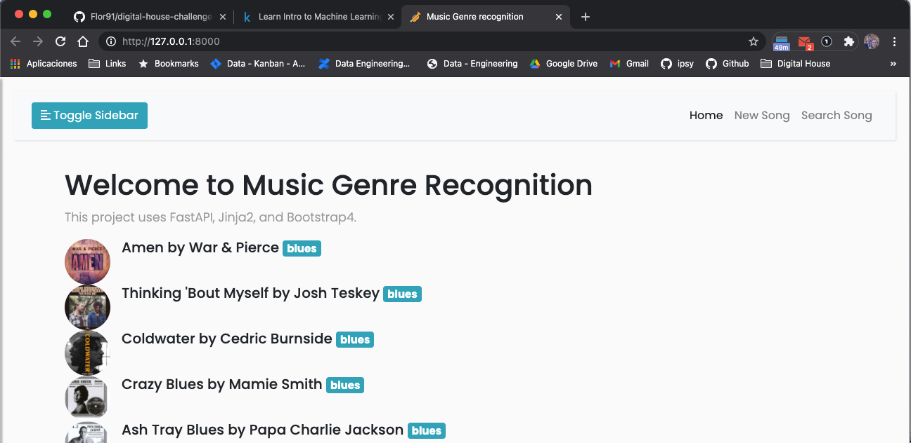
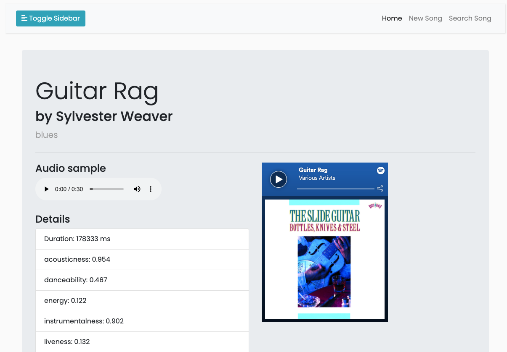

# Days of Data

This is my journey into x days of data, where I will learn about Data Science, Machine Learning and Deep Learning technologies.

I won't be committing to an exact number of days, or even trying to work on this every day - not even for 5 minutes, sorry - because of life (I am expecting a baby boy!).

But I encourage anyone interested on this challenge to follow the rules set up by [#66DaysOfData](https://www.youtube.com/watch?v=qV_AlRwhI3I).

## Day 1

On this first day of x days of data I started easy by doing some [Meta Learning](https://webbswideworld.com/2019/09/09/the-principles-of-ultralearning-1-metalearning/).


### 1 - Watched some Youtube videos:
- [Step By Step Action Plan For Learning Data Science](https://www.youtube.com/watch?v=lP1hb4BFAWA&t=2s) By [Krish Naik](https://www.youtube.com/user/krishnaik06)
- [How I would learn data science in 2021](https://www.youtube.com/watch?v=41Clrh6nv1s) By [Ken Jee](https://www.youtube.com/c/KenJee1)
- [How to ULTRALEARN Data Science](https://www.youtube.com/watch?v=a3VWq9smqhM)
- [The 5 Stages of Learning Data Science](https://www.youtube.com/watch?v=hpMc6TgT34I)

### 2 - Completed [Kaggle's Python](https://www.kaggle.com/learn/python) course
Review Python concepts needed for Data Science and Machine learning.


### 3 - Started [Kaggle's Intro to Machine Learning](https://www.kaggle.com/learn/intro-to-machine-learning) course

Learn the core ideas in machine learning, and build my first models.

### Notes
#### Learning Data Science Roadmap 🛣️
1. Programming Language
    - Select one (Python, R, Java...) I will work with Python.
    - Data Structures, Functions, OOPS, Exception handling, List comprehension, external libraries
2. Python Libraries to work with complex data structures
    - Numpy
    - Pandas
3. Statistics and Probability
    - Basic concepts: Mean, Median, Mode...
    - Distributions: Normal, Standard, ...
4. Visualization
    - MatplotLib
    - Seaborn
5. Exploratory Data Analysis (EDA)
    - Feature engineering
    - Cleaning data
    - Data formating, Normalization: Scalers
6. Machine Learning algorithms
    - understand theory and concepts behind each of the top 20 basic algorithms
7. Deployment
    - AWS, GCP, Heroku
    - Flask, FastAPI, Django
    - Docker, Kubernetes
8. Deep Learning
     - 3 basic Neural Algos: Aritifical(ANN),Convolutional(CNN) & Recurrent(RNN)
     - TensorFlow, Keras, Pytorch
9. Databases:
     - SQL for structured data
     - MongoDB for unstructured data
10. Visualization:
     - PowerBI
     - Tableau
     - Qlik Sense

---

## Day 2 & 3

Working on [Music Genre Recognition APP](https://github.com/Flor91/digital-house-challenge-3), 
a FastAPI app that recognizes music genres based on an Spotify URI.






#### Technologies used:
- [FastAPI](https://fastapi.tiangolo.com/): modern, fast (high-performance), web framework for building APIs with Python 3.6+ based on standard Python type hints.
- [OpenAPI](https://github.com/OAI/OpenAPI-Specification): (ex. Swagger) The OpenAPI Specification (OAS) defines a standard, programming language-agnostic interface description for HTTP APIs, which allows both humans and computers to discover and understand the capabilities of a service without requiring access to source code, additional documentation, or inspection of network traffic. 
- [Starlette](https://www.starlette.io/): Starlette is a lightweight ASGI framework/toolkit, which is ideal for building high performance asyncio services.
- [Pydantic](https://pydantic-docs.helpmanual.io/): Data validation and settings management using python type annotations.
- [SQLAlchemy](https://www.sqlalchemy.org/): SQLAlchemy is the Python SQL toolkit and Object Relational Mapper that gives application developers the full power and flexibility of SQL.
- [Jinja2](https://jinja.palletsprojects.com/en/2.11.x/): modern and designer-friendly templating language for Python, modelled after Django’s templates. 
- [Boostrap](https://getbootstrap.com/docs/5.0/getting-started/introduction/): world’s most popular front-end open source toolkit, featuring Sass variables and mixins, responsive grid system, extensive prebuilt components, and powerful JavaScript plugins.

#### For data processing:
- [Librosa](https://librosa.org/): Audio and music processing with Python
- [Spotipy](https://spotipy.readthedocs.io/en/2.16.1/): lightweight Python library for the [Spotify Web API](https://developer.spotify.com/documentation/web-api/). 
- [pydub](https://github.com/jiaaro/pydub):  Manipulate audio with a simple and easy high level interface

---

## Day 4

### 3 - Continued [Kaggle's Intro to Machine Learning](https://www.kaggle.com/learn/intro-to-machine-learning) course

   #### 1. How models work                  ✔️
      
   The step of capturing patterns from data is called fitting or training the model. 
   The data used to fit the model is called the training data.
   After the model has been fit, we can use it to predict new data.
      
   #### 2. Basic Data Exploration           ✔️
   ```python
   # save filepath to variable for easier access
   melbourne_file_path = '../input/melbourne-housing-snapshot/melb_data.csv'
   # read the data and store data in DataFrame titled melbourne_data
   melbourne_data = pd.read_csv(melbourne_file_path) 
   # print a summary of the data in Melbourne data
   melbourne_data.describe()
   
   melbourne_data.columns    
   ```

   #### 3. First ML Model                   ✔️
   The column we want to predict is the target (y).
   The columns used to make the predictions, inputted into our model are the features (X).
   
   The steps to building and using a model are:
   
   - Define: What type of model will it be? A decision tree? Some other type of model? Some other parameters of the model type are specified too.
   - Fit: Capture patterns from provided data. This is the heart of modeling.
   - Predict: Just what it sounds like
   - Evaluate: Determine how accurate the model's predictions are.

   #### 4. Model Validation
   There are several metrics for summarizing model quality. The first one we will see is:
   - Mean Absolute Error (MAE): On average how off our predictions are from the real value.

   ```python
    from sklearn.model_selection import train_test_split
    import pandas as pd
   from sklearn.tree import DecisionTreeRegressor
   
   # Path of the file to read
   iowa_file_path = '../input/home-data-for-ml-course/train.csv'
   
   home_data = pd.read_csv(iowa_file_path)
   y = home_data.SalePrice
   feature_columns = ['LotArea', 'YearBuilt', '1stFlrSF', '2ndFlrSF', 'FullBath', 'BedroomAbvGr', 'TotRmsAbvGrd']
   X = home_data[feature_columns]

   # split data into training and validation data, for both features and target
   # The split is based on a random number generator. Supplying a numeric value to
   # the random_state argument guarantees we get the same split every time we
   # run this script.
   train_X, val_X, train_y, val_y = train_test_split(X, y, random_state = 0)
   
   # Specify Model
   iowa_model = DecisionTreeRegressor()
   # Fit Model
   iowa_model.fit(train_X, train_y)
   
   print("First in-sample predictions:", iowa_model.predict(val_X.head()))
   print("Actual target values for those homes:", val_y.head().tolist())

   # get predicted prices on validation data
   val_predictions = .predict(val_X)
   print(mean_absolute_error(val_y, val_predictions))
   ```
   
   #### 5. Underfitting and Overfitting
   Overfitting, where a model matches the training data almost perfectly, but does poorly in validation and other new data.
   When a model fails to capture important distinctions and patterns in the data, so it performs poorly even in training data, that is called underfitting.

   
   #### 6. Random Forest
   #### 7. ML Competitions

[Submited notebook](https://www.kaggle.com/flor991/exercise-machine-learning-competitions)

