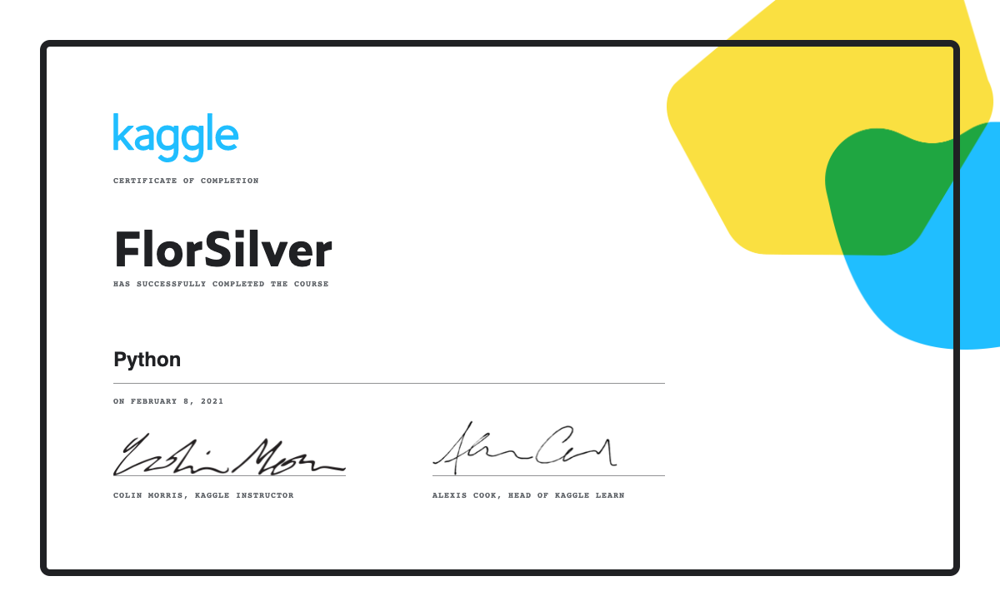

# Day 1

On this first day of x days of data I started easy by doing some [Meta Learning](https://webbswideworld.com/2019/09/09/the-principles-of-ultralearning-1-metalearning/), inspired by [#66DaysOfData](https://www.youtube.com/watch?v=qV_AlRwhI3I).

### 1 - Watched some Youtube videos:
- [Step By Step Action Plan For Learning Data Science](https://www.youtube.com/watch?v=lP1hb4BFAWA&t=2s) By [Krish Naik](https://www.youtube.com/user/krishnaik06)
- [How I would learn data science in 2021](https://www.youtube.com/watch?v=41Clrh6nv1s) By [Ken Jee](https://www.youtube.com/c/KenJee1)
- [How to ULTRALEARN Data Science](https://www.youtube.com/watch?v=a3VWq9smqhM)
- [The 5 Stages of Learning Data Science](https://www.youtube.com/watch?v=hpMc6TgT34I)

### 2 - Completed [Kaggle's Python](https://www.kaggle.com/learn/python) course
Review Python concepts needed for Data Science and Machine learning.

### 3 - Started [Kaggle's Intro to Machine Learning](https://www.kaggle.com/learn/intro-to-machine-learning) course

Learn the core ideas in machine learning, and build my first models.

### Notes
#### Learning Data Science Roadmap 🛣️
1. Programming Language
    - Select one (Python, R, Java...) I will work with Python.
    - Data Structures, Functions, OOPS, Exception handling, List comprehension, external libraries
2. Python Libraries to work with complex data structures
    - Numpy
    - Pandas
3. Statistics and Probability
    - Basic concepts: Mean, Median, Mode...
    - Distributions: Normal, Standard, ...
4. Visualization
    - MatplotLib
    - Seaborn
5. Exploratory Data Analysis (EDA)
    - Feature engineering
    - Cleaning data
    - Data formating, Normalization: Scalers
6. Machine Learning algorithms
    - understand theory and concepts behind each of the top 20 basic algorithms
7. Deployment
    - AWS, GCP, Heroku
    - Flask, FastAPI, Django
    - Docker, Kubernetes
8. Deep Learning
     - 3 basic Neural Algos: Aritifical(ANN),Convolutional(CNN) & Recurrent(RNN)
     - TensorFlow, Keras, Pytorch
9. Databases:
     - SQL for structured data
     - MongoDB for unstructured data
10. Visualization:
     - PowerBI
     - Tableau
     - Qlik Sense

